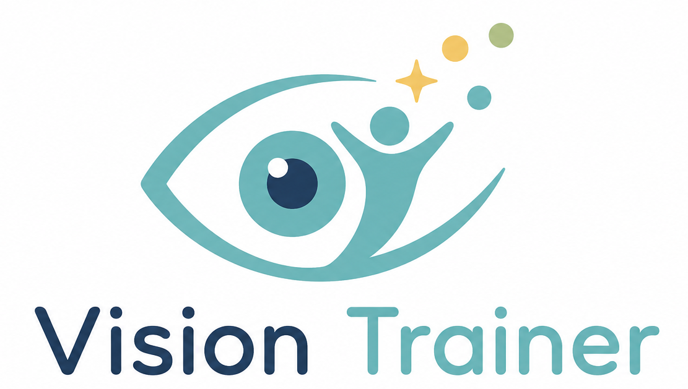

>⚠️ This repo will be archived intergrated to a new repo. The old web url is still searchable, and will be redirect to new url: https://rehabtrainerhub.pages.dev

# Vision Trainer



Vision Trainer is a browser-based visual training and assessment app built with React, TypeScript, Vite, jsPsych, PixiJS, Three.js, and WebGazer.

It includes visual training exercises, visual acuity assessments, screen calibration tools, user profiles, and CSV result export. This project is for training, rehab workflow prototyping, and programming practice. It is not medical advice.

## Features

- Visual training modules: Moving Card, Oculomotor Training, Gabor Patching, Reading Training (RSVP), Driving Cognitive Rehab Simulator, and Hart Chart Training.
- Visual assessments: Landolt C, Tumbling E, Sloan Letters, Shapes, Preferential Looking (PL), and Contrast Sensitivity.
- Calibration: screen size, viewing distance, gamma, crowding, and WebGazer webcam calibration.
- Results: local browser records and CSV export.
- UI languages: English and Traditional Chinese.

## Tech Stack

- React 19
- TypeScript
- Vite
- React Router 7
- jsPsych 8
- PixiJS 8
- Three.js
- WebGazer.js

## Project Structure

```text
src/
  App.tsx                         App routes and layout
  main.tsx                        React entry point
  components/                     Shared UI components
  experiment/                     jsPsych timelines and plugins
  i18n/                           Translation provider and strings
  pages/
    assessment/                   Visual assessment pages and logic
    credits/                      Credit page
    home/                         Home page module definitions
    links/                        Related links page
    settings/                     Calibration and app settings
    training/                     Training pages, data, and results
  utils/                          Settings, storage, math, CSV, Pixi helpers
public/
  assets/                         Images and logos
  webgazer.js                     Local WebGazer runtime
```

## Development

```bash
npm install
npm run dev
npm run build
npm run preview
```

## Deployment

The Vite build writes static files to `dist/`.

```bash
npm run build
```

Deploy the `dist/` directory to any static host, including GitHub Pages.

## Credits

- [FrACT10](https://github.com/michaelbach/FrACT10) for visual acuity and calibration references.
- [styts/eye-training](https://github.com/styts/eye-training) for moving-card training references.
- [Jesper-N/foveaflow](https://github.com/Jesper-N/foveaflow) for oculomotor training references.
- [Fordi/gabor-patching](https://github.com/Fordi/gabor-patching) for Gabor patching references.
- [visiontherapy.github.io](https://github.com/visiontherapy/visiontherapy.github.io) for Hart Chart and vision therapy references.
