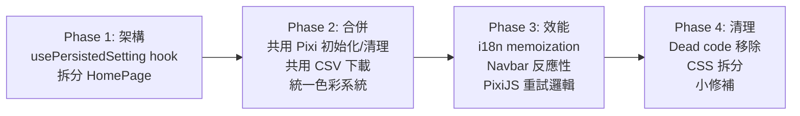

# VisionTrainer Codebase Analysis Report

> [!IMPORTANT]
> 發現 **50+ 個問題**，依嚴重性分類：**12 HIGH** / **20 MEDIUM** / **18+ LOW**
> 以下按影響程度排序，附具體代碼位置和建議修復方案。

---

## 🔴 HIGH 嚴重性問題

### 1. HomePage.tsx 是 1413 行的 God Component

**檔案**: [HomePage.tsx](file:///P:/3_WebSite/VisionTrainer/src/pages/HomePage.tsx)
**行數**: 1413 行 / 56KB

這是整個 codebase 最嚴重的問題。單一元件包含：
- **30+ 個 `useState` hooks** (L28-94)
- **22 個獨立的 `useEffect` hooks** 僅用於同步設定到 localStorage (L152-246)
- 所有訓練模組的配置 UI 全部內嵌

```diff
- // 目前：22 個完全相同模式的 useEffect
- useEffect(() => { setSetting('oculomotorMode', oculomotorMode); }, [oculomotorMode]);
- useEffect(() => { setSetting('oculomotorPattern', oculomotorPattern); }, [oculomotorPattern]);
- useEffect(() => { setSetting('oculomotorDurationSec', oculomotorDurationSec); }, [oculomotorDurationSec]);
- // ... 重複 19 次以上

+ // 建議：使用自訂 hook 統一處理
+ function usePersistedSetting<K extends keyof AppSettings>(key: K) {
+   const [value, setValue] = useState(() => getSetting(key));
+   useEffect(() => { setSetting(key, value); }, [key, value]);
+   return [value, setValue] as const;
+ }
+ // 用法：
+ const [oculomotorMode, setOculomotorMode] = usePersistedSetting('oculomotorMode');
```

**建議**:
1. 建立 `usePersistedSetting` custom hook，消除 22 個重複的 useEffect
2. 將每個訓練模組的配置面板拆分為獨立元件（`MovingCardConfig.tsx`, `OculomotorConfig.tsx` 等）
3. 將模組卡片列表資料抽成靜態資料結構

---

### 2. 三重定義的色彩系統 — 已經出現不同步

**檔案**: [theme.ts](file:///P:/3_WebSite/VisionTrainer/src/theme.ts) + [index.css](file:///P:/3_WebSite/VisionTrainer/src/index.css)

同一個色彩值在 3 個地方分別定義：

| 位置 | 範例 |
|------|------|
| `theme.ts` → `pixiColors` | `accent: 0x005EB8` |
| `theme.ts` → `cssColors` | `accent: '#005EB8'` |
| `index.css` → `:root` | `--accent: #005EB8` |

**已出現不同步**: `--radius-s: 8px` (CSS) vs `radiusS: 4` (theme.ts)

```diff
+ // 建議：從 pixiColors 自動衍生 cssColors
+ export const cssColors = Object.fromEntries(
+   Object.entries(pixiColors).map(([k, v]) => [k, hexToCSS(v)])
+ ) as Record<keyof typeof pixiColors, string>;
```

---

### 3. pixi-contrast-sensitivity.ts 中方向判斷邏輯重複且有 Bug

**檔案**: [pixi-contrast-sensitivity.ts](file:///P:/3_WebSite/VisionTrainer/src/experiment/plugins/pixi-contrast-sensitivity.ts) L140-216

`endTrial()` 中，按鍵到方向的映射被**完整寫了三遍**（grating、landolt、tumblingE 各一次），且 `landolt` 的判斷邏輯出現在兩個位置：

- **第一次** L148-152：用陣列索引判斷（`expectedKey = keys[trial.direction!]`），但結果 `expectedKey` 之後從未使用
- **第二次** L182-202：重新展開完整的 if/else 鏈

```diff
+ // 建議：抽取共用的方向映射函式
+ function keyToDirection(key: string): number {
+   const map: Record<string, number> = {
+     arrowright: 0, '6': 0,
+     arrowup: 2, '8': 2,
+     arrowleft: 4, '4': 4,
+     arrowdown: 6, '2': 6,
+     // ... 斜向
+   };
+   return map[key.toLowerCase()] ?? -1;
+ }
```

---

### 4. Navbar 顯示過期的使用者資訊

**檔案**: [Navbar.tsx](file:///P:/3_WebSite/VisionTrainer/src/components/Navbar.tsx) L7

```tsx
// 問題：直接在 render body 呼叫 localStorage，不會因使用者切換而更新
const user = getActiveUser();
```

使用者在 HomePage 切換後，Navbar 不會重新渲染，顯示的仍是舊的使用者名稱。

```diff
+ // 建議：使用 state + storage event
+ const [user, setUser] = useState(getActiveUser);
+ useEffect(() => {
+   const handler = () => setUser(getActiveUser());
+   window.addEventListener('storage', handler);
+   return () => window.removeEventListener('storage', handler);
+ }, []);
```

---

### 5. PixiJS 初始化失敗後永遠無法重試

**檔案**: [pixiPool.ts](file:///P:/3_WebSite/VisionTrainer/src/utils/pixiPool.ts) L96-107

如果 `app.init()` 失敗（如 WebGL 不支援），`initPromise` 會保留被拒絕的 Promise，後續呼叫 `warmUp()` 永遠返回同一個失敗的 Promise，無法重試。

```diff
  private async _init(): Promise<void> {
+   try {
      this.app = new Application();
      await this.app.init({ ... });
      this._ready = true;
+   } catch (e) {
+     this.app = null;
+     this.initPromise = null; // 允許重試
+     throw e;
+   }
  }
```

---

### 6. three-driving-rehab.ts 是 2441 行的巨型檔案

**檔案**: [three-driving-rehab.ts](file:///P:/3_WebSite/VisionTrainer/src/experiment/plugins/three-driving-rehab.ts) — **90KB / 2441 行**

單一檔案包含：
- 完整的 3D 場景建構（道路、建築、天空盒）
- 物理模擬（車輛動力學、碰撞檢測）
- 危險事件系統
- HUD 介面
- 遊戲手柄/鍵盤輸入處理
- 路線導航系統
- 雙語文字系統
- Mini-map 渲染

**建議拆分**:
- `driving-route.ts` — 路線定義與導航
- `driving-vehicle.ts` — 車輛物理與碰撞
- `driving-hazards.ts` — 危險事件管理
- `driving-hud.ts` — HUD 介面
- `driving-input.ts` — 輸入處理
- `driving-scene.ts` — 3D 場景建構
- `driving-text.ts` — 雙語文字定義

---

### 7. CSV 下載邏輯重複 3 次

**檔案**:
- [AcuityTestPage.tsx](file:///P:/3_WebSite/VisionTrainer/src/pages/assessment/AcuityTestPage.tsx) L682
- [ContrastTestPage.tsx](file:///P:/3_WebSite/VisionTrainer/src/pages/assessment/ContrastTestPage.tsx) L170
- [exportCsv.ts](file:///P:/3_WebSite/VisionTrainer/src/pages/training/exportCsv.ts) L96

三處都有相同的 `Blob → URL.createObjectURL → click → revokeObjectURL` 邏輯。

```diff
+ // 建議：在 utils/ 中建立共用函式
+ export function downloadFile(content: string, filename: string, mimeType = 'text/csv') {
+   const blob = new Blob([content], { type: mimeType });
+   const url = URL.createObjectURL(blob);
+   const a = document.createElement('a');
+   a.href = url;
+   a.download = filename;
+   a.click();
+   URL.revokeObjectURL(url);
+ }
```

---

### 8. PixiJS 插件的 DOM 容器設定重複 5 次

**檔案**: 所有 `pixi-*.ts` 插件

每個 Pixi 插件都有幾乎完全相同的容器初始化邏輯：

```ts
// 出現在每個插件的 trial() 開頭
display_element.innerHTML = '';
const container = document.createElement('div');
container.style.width = '100%';
container.style.height = '100%';
container.style.position = 'absolute';
container.style.top = '0';
container.style.left = '0';
display_element.appendChild(container);
pixiAppManager.attachTo(container);
pixiAppManager.clearStage();
```

以及完全相同的結束邏輯：

```ts
manager.clearStage();
manager.detachCanvas();
display_element.innerHTML = '';
```

```diff
+ // 建議：在 pixiPool.ts 中加入共用方法
+ export function createTrialContainer(displayElement: HTMLElement): HTMLDivElement { ... }
+ export function cleanupTrial(displayElement: HTMLElement): void { ... }
```

---

### 9. 插件的 App 初始化模式重複 4 次

**檔案**: pixi-moving-card.ts, pixi-oculomotor-training.ts, pixi-reading-training.ts, pixi-gabor-patching.ts

每個插件結尾都有相同的初始化分支：

```ts
if (manager.ready) {
  runWithApp(manager.getApp()!);
} else {
  manager.ensureReady().then(runWithApp).catch((err) => {
    display_element.innerHTML = `<div style="color:red;padding:20px;">PixiJS 初始化失敗: ${err.message}</div>`;
  });
}
```

應提取為共用函式。

---

## 🟡 MEDIUM 嚴重性問題

### 10. i18n `t()` 函式每次 render 都重新建立

**檔案**: [i18n.tsx](file:///P:/3_WebSite/VisionTrainer/src/i18n/i18n.tsx) L30-45

`t()` 是每次 render 都建立的新閉包，導致所有使用 `useT()` 的元件在 `LanguageProvider` re-render 時全部跟著 re-render。

```diff
- const t = (key: TranslationKey, params?: ...) => { ... };
+ const t = useCallback((key: TranslationKey, params?: ...) => { ... }, [lang]);
+ const contextValue = useMemo(() => ({ lang, setLang, t }), [lang, setLang, t]);
```

---

### 11. SoundManager AudioContext 從未關閉

**檔案**: [soundManager.ts](file:///P:/3_WebSite/VisionTrainer/src/utils/soundManager.ts) L14

`AudioContext` 建立後永遠不會關閉，即使使用者離開需要音效的頁面也不會釋放。應加入 `destroy()` 方法。

---

### 12. `playRunEnd()` 在 feedback 停用時仍建立 AudioContext

**檔案**: [soundManager.ts](file:///P:/3_WebSite/VisionTrainer/src/utils/soundManager.ts) L73-75

```ts
playRunEnd(): void {
  const ctx = this.ensureContext(); // 先建立 context
  if (!ctx || !getSetting('auditoryFeedbackEnabled')) return; // 才檢查是否啟用
}
```

順序應顛倒：先檢查是否啟用，再建立 context。

---

### 13. AcuityTestPage.tsx 也是超大元件 (30KB)

**檔案**: [AcuityTestPage.tsx](file:///P:/3_WebSite/VisionTrainer/src/pages/assessment/AcuityTestPage.tsx)

類似 HomePage 的問題，應將測試邏輯、結果顯示、圖表渲染分別拆分為獨立元件。

---

### 14. `isCalibrated()` 用預設值比較判斷是否已校準

**檔案**: [settings.ts](file:///P:/3_WebSite/VisionTrainer/src/utils/settings.ts) L143-148

如果使用者校準後恰好得到與預設值相同的結果，系統會錯誤地顯示「未校準」。應改為儲存 `calibratedAt` 時間戳。

---

### 15. spatialUtils 與 settings 之間的重複算術

**檔案**: [spatialUtils.ts](file:///P:/3_WebSite/VisionTrainer/src/utils/spatialUtils.ts) L19-26

`pixelFromMillimeter()` 和 `millimeterFromPixel()` 重新實作了 `settings.ts` 中已有的 `getPixelsPerMM()` / `getMMPerPixel()` 邏輯。

```diff
  export function pixelFromMillimeter(mm: number): number {
-   return mm * CAL_BAR_LENGTH_PX / getSetting('calBarLengthInMM');
+   return mm * getPixelsPerMM();
  }
```

---

### 16. `pxPerMm()` 是未被使用的 dead code

**檔案**: [spatialUtils.ts](file:///P:/3_WebSite/VisionTrainer/src/utils/spatialUtils.ts) L29-31

```ts
export function pxPerMm(): number {
  return getPixelsPerMM(); // 只是重新 export，且沒有任何地方使用
}
```

應直接刪除。

---

### 17. index.css 是 1692 行的巨型單檔

**檔案**: [index.css](file:///P:/3_WebSite/VisionTrainer/src/index.css) — 34KB

所有頁面、元件的樣式都混在同一個檔案中。建議按功能拆分為多個 CSS 檔案。

---

### 18. 重複的 responsive grid 樣式

**檔案**: [index.css](file:///P:/3_WebSite/VisionTrainer/src/index.css)

`.training-grid` 和 `.assessment-grid` 使用完全相同的 responsive breakpoint 邏輯，可合併為一個通用的 `.responsive-grid` class。

---

### 19. Gabor 紋理每次產生都建立新 Canvas

**檔案**: [pixi-gabor-patching.ts](file:///P:/3_WebSite/VisionTrainer/src/experiment/plugins/pixi-gabor-patching.ts) L58-91

`createGaborTexture()` 使用逐像素運算（256×256 = 65,536 像素 × 每像素 4 個三角函數運算），每次 trial 建立 3 個紋理。可考慮快取或預計算。

---

### 20. pixi-gabor-patching 浮動分數動畫使用獨立的 rAF 迴圈

**檔案**: [pixi-gabor-patching.ts](file:///P:/3_WebSite/VisionTrainer/src/experiment/plugins/pixi-gabor-patching.ts) L310-322

每次點擊 spot 都啟動一個獨立的 `requestAnimationFrame` 迴圈來動畫化浮動分數文字。如果快速點擊，可能同時有多個獨立的 rAF 迴圈在運行。應整合到主遊戲迴圈中。

---

## 🟢 LOW 嚴重性問題

### 21. Navbar NavLink className 回調重複 4 次

```tsx
className={({ isActive }) => `navbar-link ${isActive ? 'active' : ''}`}
// 完全相同的寫法出現 4 次
```

### 22. i18n.tsx 匯入了未使用的 `useEffect`

### 23. `resetAllSettings()` 寫入預設值而非刪除 key
刪除 localStorage key 效果相同（因為 `getSetting` 在找不到 key 時返回預設值），且效率更高。

### 24. `main.tsx` 對 root 元素使用 non-null assertion `!`

### 25. App.tsx 使用巢狀 `<Routes>` 而非 Layout Routes
應改用 React Router v6 的 Layout Route 模式。

### 26. PixiJS 強制最低 2x resolution
在 1x 裝置上不必要地增加 GPU 負擔。

### 27. index.css 大量使用 `!important` 覆蓋 jsPsych 樣式

### 28. 部分 inline style objects 在每次 render 時重新建立
HomePage 和 SettingsPage 中有多個 `style={{ ... }}` 會在每次 render 時建立新物件。

### 29. 硬編碼的中文字串散布在非 i18n 檔案中
部分元件（如 reading-training 配置面板）有硬編碼的中文，未使用 i18n。

### 30. oculomotor plugin 中的 `modeTitle` 重複了 i18n 中已有的翻譯

---

## 📊 改善優先級建議



| 階段 | 預估影響 | 涉及問題 |
|------|---------|---------|
| **Phase 1** | 大幅降低 HomePage 維護成本 | #1 |
| **Phase 2** | 消除 ~300 行重複代碼 | #3, #7, #8, #9, #2 |
| **Phase 3** | 改善執行效率與正確性 | #4, #5, #10, #12 |
| **Phase 4** | 程式碼品質提升 | #16-30 |

---

> [!TIP]
> 最高 ROI 的改善是建立 `usePersistedSetting` hook — 僅 10 行程式碼就能消除 22 個 useEffect 和 30+ 行重複。
